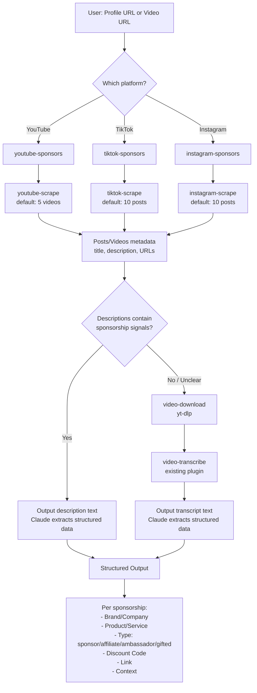

# Social Scraper Plugin — Design Spec

## Overview

A Claude Code plugin that wraps Apify APIs to scrape YouTube, TikTok, and Instagram profiles for recent sponsorships and partnerships. Uses a two-pass detection strategy: description/caption analysis first, video transcription fallback second.

## Architecture

### Plugin Structure

Single plugin (`social-scraper`) with 7 skills across 3 layers:

```
plugins/social-scraper/
├── .claude-plugin/
│   └── plugin.json
├── .env.example              # APIFY_API_TOKEN=your-token
├── .env
├── README.md
└── skills/
    ├── youtube-scrape/        # Layer 1: Data Fetching
    │   ├── SKILL.md
    │   └── scripts/scrape.sh
    ├── tiktok-scrape/
    │   ├── SKILL.md
    │   └── scripts/scrape.sh
    ├── instagram-scrape/
    │   ├── SKILL.md
    │   └── scripts/scrape.sh
    ├── video-download/        # Layer 2: Media Download
    │   ├── SKILL.md
    │   └── scripts/download.sh
    ├── youtube-sponsors/      # Layer 3: Orchestration (SKILL.md only)
    │   └── SKILL.md
    ├── tiktok-sponsors/
    │   └── SKILL.md
    └── instagram-sponsors/
        └── SKILL.md
```

### Skill Layers

#### Layer 1 — Data Fetching (Apify)

Three platform-specific scrape skills. Each accepts a profile URL or single post/video URL and returns structured JSON metadata.

| Skill | Apify Actor | Default Count | Input |
|---|---|---|---|
| `youtube-scrape` | `apidojo~youtube-scraper` | 5 | Channel URL or video URL |
| `tiktok-scrape` | `apidojo~tiktok-scraper` | 10 | Profile URL or video URL |
| `instagram-scrape` | `apidojo~instagram-scraper` | 10 | Profile URL or post URL |

**API call pattern** (all three use Apify sync endpoint):

```bash
curl -s -X POST \
  -H "Content-Type: application/json" \
  -H "Authorization: Bearer $APIFY_API_TOKEN" \
  -d "$INPUT_JSON" \
  "https://api.apify.com/v2/acts/${ACTOR_ID}/run-sync-get-dataset-items?timeout=300"
```

**Output:** JSON array of post objects, each containing at minimum:
- `url` — direct link to the video/post
- `title` — video title (YouTube) or empty
- `description` / `caption` — full text content
- `date` — publish date
- `engagement` — views, likes, comments

**Flags:**
- `--count N` — override default number of posts to fetch
- `--url <URL>` — the profile or video URL (positional arg)

#### Layer 2 — Media Download

| Skill | Tool | Input | Output |
|---|---|---|---|
| `video-download` | `yt-dlp` | Any video URL (YouTube/TikTok/Instagram) | Local file path |

**Implementation:**
- Auto-installs `yt-dlp` via brew/pip if missing
- Downloads to temp directory
- Outputs the file path to stdout
- Supports `--output-dir` flag for custom download location
- Platform-agnostic: `yt-dlp` handles all three platforms

#### Layer 3 — Orchestration (Sponsorship Detection)

Three platform-specific sponsor skills. **These are Claude-orchestrated, not script-orchestrated.** The SKILL.md is the orchestration layer — it instructs Claude to chain the atomic skills in sequence. There is no `sponsors.sh` script; the SKILL.md itself defines the multi-step workflow.

**The SKILL.md for each orchestration skill instructs Claude to:**

1. Run the corresponding `scrape` skill's script to get recent posts metadata
2. Analyze the descriptions/captions for sponsorship signals
3. If no clear sponsorships found:
   - Run `video-download` skill's `download.sh` to download the video file
   - Run `video-transcribe` skill (existing plugin) to transcribe the downloaded file
   - Analyze the transcript for sponsorship signals
4. Extract and present structured sponsorship data

**Cross-plugin handoff:** Claude captures the file path output from `video-download` and passes it as the input argument to `video-transcribe`. This is the same pattern the existing `video-transcribe` SKILL.md already uses — Claude runs a bash command with a file path argument. No direct script-to-script calls across plugins.

**Example SKILL.md orchestration instruction:**

```markdown
## Workflow
1. Run: bash "${CLAUDE_SKILL_DIR}/../youtube-scrape/scripts/scrape.sh" "<URL>" --count 5
2. Analyze the JSON output for sponsorship signals in descriptions
3. If sponsorships found → extract structured data and present results
4. If no sponsorships found → for each video URL:
   a. Run: bash "${CLAUDE_SKILL_DIR}/../video-download/scripts/download.sh" "<VIDEO_URL>"
   b. Capture the output file path
   c. Run the video-transcribe skill with that file path
   d. Analyze transcript for sponsorship signals
5. Present all findings in structured format
```

### Flowchart



### Structured Output Format

Claude extracts the following per sponsorship found:

| Field | Description | Example |
|---|---|---|
| Brand/Company | Sponsor name | "NordVPN" |
| Product/Service | What's being promoted | "VPN service" |
| Type | sponsor, affiliate, ambassador, gifted | "sponsor" |
| Discount Code | If mentioned | "MKBHD20" |
| Link | Sponsor URL from description | "nordvpn.com/mkbhd" |
| Context | What was said about the sponsor | "30-second mid-roll about online privacy" |

## Dependencies

| Dependency | Purpose | Install |
|---|---|---|
| `curl` | Apify API calls | Pre-installed on macOS/Linux |
| `jq` | JSON parsing | `brew install jq` / `apt install jq` |
| `yt-dlp` | Video downloading | `brew install yt-dlp` / `pip install yt-dlp` |
| `video-transcribe` plugin | Audio transcription (fallback) | Existing plugin in marketplace |
| OpenAI API | Transcription (`gpt-4o-transcribe`) + analysis (`gpt-5.4-nano`) | `OPENAI_API_KEY` in `.env` |

All dependencies auto-install if missing (macOS via brew, Linux via apt/pip).

## Models

| Purpose | Model | Pricing | Notes |
|---|---|---|---|
| Transcription (fallback) | `gpt-4o-transcribe` | $0.006/min | Best accuracy at same price as whisper-1 |
| Sponsorship extraction | `gpt-5.4-nano` | $0.20/1M in, $1.25/1M out | Purpose-built for data extraction, released 2026-03-17 |

- **Transcription:** `gpt-4o-transcribe` replaces `whisper-1` as the default — same price, lower word error rate, better language handling.
- **Analysis:** `gpt-5.4-nano` is used for extracting structured sponsorship data from descriptions/transcripts. Extremely cheap for text classification and extraction tasks.

## Configuration

### Environment Variables

```bash
# Required
APIFY_API_TOKEN=your-apify-api-token

# Required for sponsorship analysis via OpenAI
OPENAI_API_KEY=sk-your-key

# Optional overrides
TRANSCRIPTION_MODEL=gpt-4o-transcribe    # default
ANALYSIS_MODEL=gpt-5.4-nano              # default
```

### .env.example

```
APIFY_API_TOKEN=your-apify-api-token-here
OPENAI_API_KEY=sk-your-key-here

# Optional: override default models
# TRANSCRIPTION_MODEL=gpt-4o-transcribe
# ANALYSIS_MODEL=gpt-5.4-nano
```

## Marketplace Registration

Add entry to the existing `plugins` array in `.claude-plugin/marketplace.json`:

```json
{
  "name": "social-scraper",
  "source": "./plugins/social-scraper",
  "description": "Scrape YouTube, TikTok, and Instagram for sponsorships and partnerships"
}
```

## Usage Examples

```bash
# Atomic skills (standalone)
/social-scraper:youtube-scrape https://youtube.com/@mkbhd
/social-scraper:tiktok-scrape https://tiktok.com/@charlidamelio --count 5
/social-scraper:instagram-scrape https://instagram.com/garyvee
/social-scraper:video-download https://youtube.com/watch?v=xyz

# Orchestration skills (full pipeline)
/social-scraper:youtube-sponsors https://youtube.com/@mkbhd
/social-scraper:tiktok-sponsors https://tiktok.com/@charlidamelio
/social-scraper:instagram-sponsors https://instagram.com/garyvee --count 20
```

## Design Decisions

1. **OpenAI models for analysis** — `gpt-5.4-nano` extracts structured sponsorship data from text. `gpt-4o-transcribe` handles transcription. Claude orchestrates the pipeline via SKILL.md.
2. **Description-first, transcription-fallback** — Descriptions are free to analyze. Transcription costs OpenAI API credits and takes time. Only fall back when descriptions yield nothing.
3. **`video-download` is platform-agnostic** — `yt-dlp` handles all three platforms. One skill instead of three.
4. **Apify sync API** — Single blocking curl call. Simpler than async polling. 300s timeout to handle slower profile scrapes. Scripts check for non-200 responses and output clear error messages.
5. **Default counts** — YouTube: 5 (longer videos, more expensive to transcribe). TikTok/Instagram: 10 (shorter content).
6. **Atomic composability** — Every skill works standalone. Orchestration skills chain them but don't hide them.
